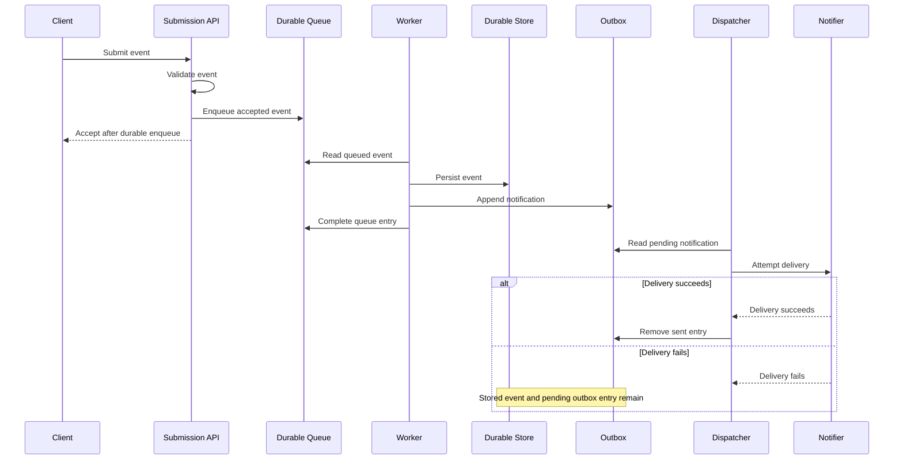

# Event-delivery architecture

Operators need to know when an accepted event becomes durable and whether a notification failure can discard the stored event.

An event is accepted only after validation and a durable queue write. A worker later persists the event, creates the outbox entry, and then completes the queue entry. Notification delivery runs separately. If delivery fails, the stored event and pending outbox entry remain; the failure does not roll back the durable event.

The diagram describes component responsibilities and ordering. Its source and nearby text can be inspected offline, but rendered layout and accessibility behavior require a compatible Mermaid renderer.
