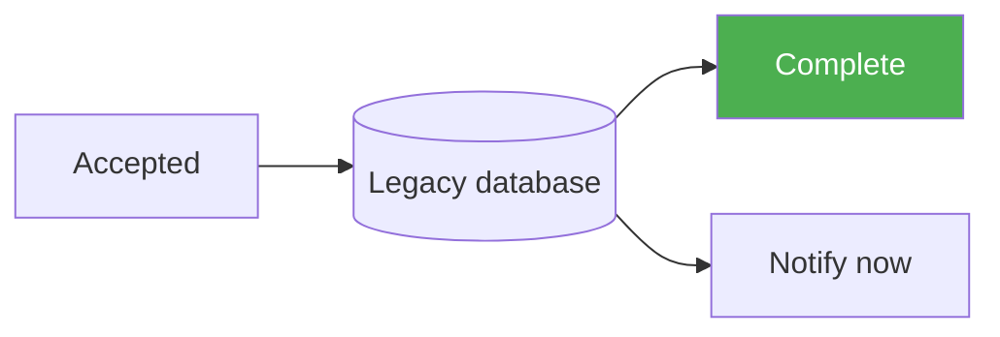

# Submission workflow architecture

The request writes directly to the legacy database and sends its notification before returning success.

Green means the operation completed. Red would mean it failed.
